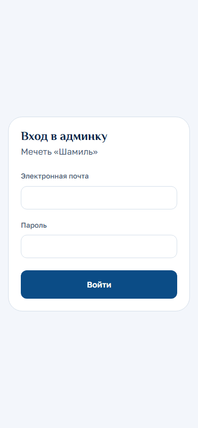
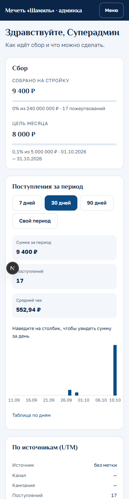
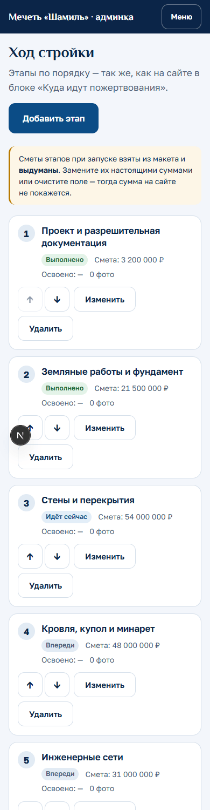
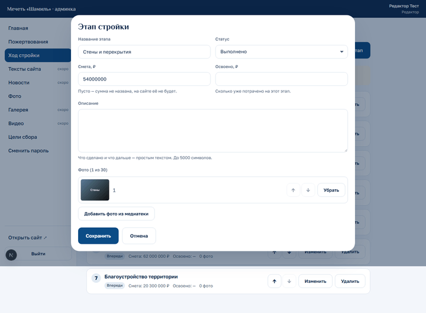
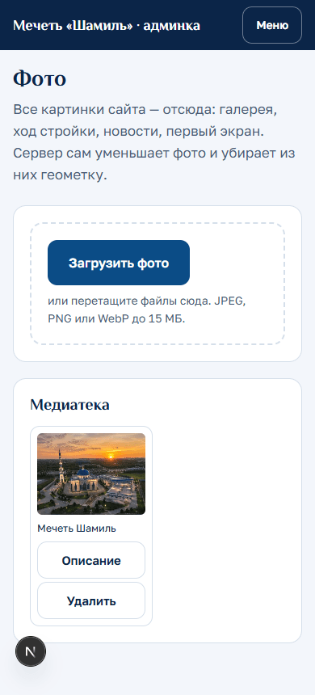
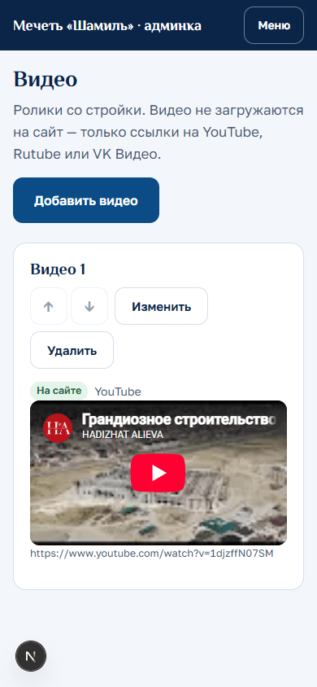
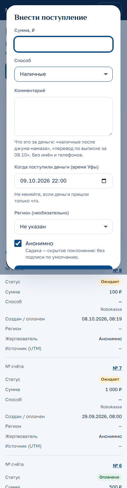
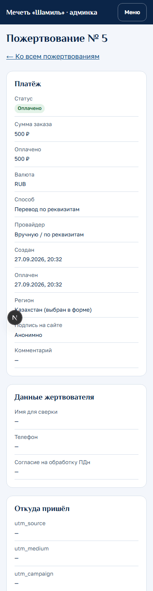
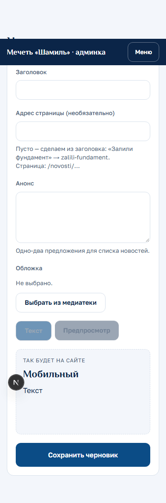
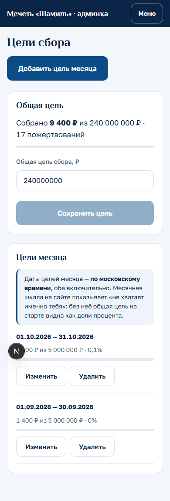

# Как пользоваться админкой сайта mechetshamil.ru

Админка — это закрытая часть сайта, где вы сами меняете тексты, показываете ход стройки, добавляете
фото и видео, вносите наличные и смотрите, сколько собрано. Работает с телефона и с компьютера.

Всё, что вы сохраните, появится на сайте **в течение минуты** — обычно сразу. Цифры сбора на сайте
обновляются каждые 15 секунд.

---

## 1. Вход и смена пароля

1. Откройте **mechetshamil.ru/admin** — или нажмите значок человечка в шапке сайта
   (на телефоне — «Вход для сотрудников» в меню).
2. Введите почту и пароль, нажмите **«Войти»**.

- Пять неверных попыток подряд — вход закрывается на 15 минут. Если забыли пароль, попросите
  суперадмина задать новый: раздел **«Пользователи»** → **«Новый пароль»**. Блокировка при этом снимется.
- Сменить свой пароль: меню → **«Сменить пароль»**. Пароль — не короче 12 символов; удобнее всего
  фраза из нескольких слов. После смены другие ваши устройства выйдут из админки.
- Выход: меню → **«Выйти»**.

Что видно в меню, зависит от роли:

| Роль | Что может |
| --- | --- |
| Суперадмин | Всё, включая пользователей и реквизиты счёта |
| Редактор | Тексты, ход стройки, новости, фото, галерея, видео, цели сбора, пожертвования (без имён и телефонов жертвователей) |
| Бухгалтер | Пожертвования с данными для сверки, выгрузка в Excel (CSV), журнал действий |

## 2. Посмотреть сбор за месяц

**«Главная»** админки — это сводка: сколько собрано всего, как идёт цель месяца, сумма и количество
поступлений за 7, 30 или 90 дней (или за свой период), график по дням, откуда пришли люди и какими
способами платили, 10 последних поступлений.

Наведите палец или мышку на столбик графика — увидите сумму за этот день. Нажмите на номер
поступления — откроется его карточка.

## 3. Обновить ход стройки

Меню → **«Ход стройки»**. Этапы идут в том же порядке, что на сайте в блоке «Куда идут пожертвования».

1. Нажмите **«Изменить»** у нужного этапа.
2. Поменяйте статус: **«Выполнено»**, **«Идёт сейчас»** или **«Впереди»**.
3. При желании впишите смету, сколько уже освоено и пару предложений о том, что сделано.
4. **«Добавить фото из медиатеки»** — отметьте снимки и нажмите **«Выбрать»**. Порядок фото меняется
   стрелками ↑ ↓.
5. **«Сохранить»**.

Порядок этапов меняется стрелками ↑ ↓ прямо в списке.

> **Важно:** суммы смет, которые стоят сейчас, взяты из макета и **выдуманы**. Замените их настоящими
> или очистите поле — тогда сумма на сайте просто не покажется.

## 4. Загрузить и заменить фото

Все картинки сайта лежат в одном месте — меню → **«Фото»** (медиатека).

1. **«Загрузить фото»** — на телефоне откроется камера или галерея. Можно выбрать сразу несколько,
   они загрузятся по очереди.
2. Подходят JPEG, PNG и WebP до 15 МБ. Сервер сам уменьшит фото и **уберёт из него геометку**.
3. После загрузки впишите, **что на фото** («Заливка фундамента, вид с севера») — это читают незрячие
   и поисковики.

Фото с iPhone в формате HEIC не принимаются. Включите на iPhone: *Настройки → Камера → Форматы →
«Наиболее совместимый»* — новые снимки будут в JPEG.

**Чтобы фото появилось на сайте**, его нужно поставить на место:
- в общую фотогалерею — меню → **«Галерея»** → **«Добавить из медиатеки»** (подпись, дата съёмки,
  «Показывать на сайте» — кнопкой «Изменить»);
- к этапу стройки — см. раздел 3;
- на первый экран (рендер мечети) или в «О проекте» — меню → **«Тексты сайта»**.

**Заменить фото:** поставьте новое на то же место («Заменить» или «Добавить из медиатеки»), старое
уберите. Удалить из медиатеки можно только фото, которое нигде не стоит, — иначе админка покажет,
где оно используется.

## 5. Добавить видео

Видео на сайт не загружается — вы вставляете **ссылку** на ролик в YouTube, Rutube или VK Видео.

1. Меню → **«Видео»** → **«Добавить видео»**.
2. Вставьте ссылку на ролик (начинается с https://), при желании — название и постер из медиатеки.
3. **«Сохранить»** — сразу появится плеер для проверки.

Первое видео в списке встанет на сайт вместо заглушки «Видео с объекта». Для **закрытого** ролика
VK нужна ссылка из кода встраивания (в ней есть `hash=`): в VK — «Поделиться» → «Экспортировать».

## 6. Внести наличные

Меню → **«Пожертвования»** → **«Внести поступление»**.

1. Сумма в рублях, способ (наличные, перевод по реквизитам, СБП).
2. **Комментарий** — что это за деньги: «наличные после джума-намаза». **Без имён и телефонов** —
   комментарий видят все сотрудники.
3. Дату не трогайте, если деньги пришли только что.
4. По умолчанию поступление **анонимное**. Подпись на сайте — только с согласия человека.
5. **«Внести»** → введите сумму ещё раз → **«Зачислить»**.

Сумма сбора на сайте вырастет в течение 15 секунд. Если интернет оборвался и вы нажали ещё раз —
не страшно: второй раз та же форма деньги не зачислит, админка скажет «уже внесено».

## 7. Подтвердить перевод по реквизитам

Когда человек выбрал на сайте «Перевод по реквизитам», в списке пожертвований появляется запись
со статусом **«Ожидает»** и провайдером «Вручную / по реквизитам».

1. Сверьтесь с банковской выпиской — найдите перевод по номеру платежа в назначении.
2. Откройте запись (номер счёта в списке) → блок **«Подтвердить перевод по реквизитам»**.
3. Если пришла другая сумма — впишите фактическую.
4. **«Подтвердить перевод»** → введите сумму ещё раз → **«Подтвердить»**.

Поиск в списке пожертвований — по номеру счёта, подписи, а у суперадмина и бухгалтера ещё по имени
для сверки и телефону. Выгрузка для Excel — **«Скачать CSV»** (суперадмин и бухгалтер), с теми же
фильтрами, что на экране.

## 8. Опубликовать новость

Меню → **«Новости»** → **«Написать новость»**.

1. Заголовок, короткий анонс, обложка из медиатеки.
2. Текст. Оформление простое: `## Подзаголовок`, `**жирный**`, `- пункт списка`,
   `[текст ссылки](https://…)`. Пустая строка — новый абзац. Шпаргалка — под полем текста.
3. Вкладка **«Предпросмотр»** показывает, как текст будет выглядеть на сайте (на компьютере — рядом).
4. **«Сохранить черновик»** — черновик на сайте не виден.
5. **«Опубликовать»** → подтвердить. Новость откроется по адресу `mechetshamil.ru/novosti/…`
   и появится в списке на странице «Отчёты». Кнопка **«Открыть на сайте»** ведёт прямо туда.
6. Убрать с сайта — **«Снять с публикации»**.

## 9. Цели сбора и тексты сайта

- **«Цели сбора»** — общая цель и **цель месяца**. Цель месяца очень важна: при цели 240 млн общая
  шкала на сайте на старте показывает доли процента, а месячная — «не хватает именно вас». Даты цели
  месяца — **по московскому времени**, оба дня включительно.

- **«Тексты сайта»** — первый экран, «О проекте», контакты, реквизиты (только суперадмин; каждую
  цифру сверяйте с выпиской — сюда придут деньги), вопросы и ответы (на сайте пока не показываются).
  Хадисы, слоган и юридические данные организации здесь не меняются — их выверяет имам и правит
  разработчик.

## Если что-то пошло не так

- **«Сессия закончилась. Войдите снова»** — войдите заново, введённое в формах до этого не сохранилось.
- **«Слишком много попыток»** — подождите минуту и нажмите «Повторить».
- **«Нет связи с сервером»** — проверьте интернет и нажмите «Повторить».
- Админка предупредит, если вы уходите со страницы с несохранёнными изменениями.
- Кто, когда и что менял — меню → **«Журнал действий»** (суперадмин и бухгалтер).
