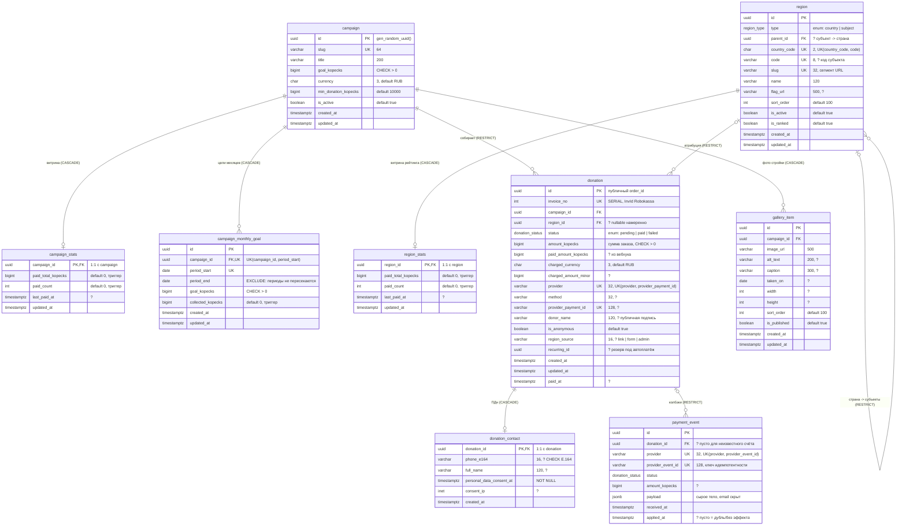

# ER-диаграмма БД mechetshamil.ru

Источник правды — [apps/api/prisma/schema.prisma](../../apps/api/prisma/schema.prisma) и четыре
миграции в [apps/api/prisma/migrations/](../../apps/api/prisma/migrations/). Состояние на 05.10.2026.
Имена таблиц и колонок — реальные, как в PostgreSQL (`@@map` / `@map`).

Пометки: **PK** — первичный ключ, **FK** — внешний ключ, **UK** — входит в уникальное
ограничение (одиночное или составное — см. комментарий). `?` в комментарии — колонка nullable.
Деньги везде — `bigint` в копейках (`*_kopecks`) или в минимальных единицах валюты (`*_minor`).

Сущностей 9 (меньше 12), поэтому отдельная обзорная диаграмма по доменам не нужна — домены
подписаны в таблице ниже.

| Домен | Таблицы |
| --- | --- |
| Сбор и витрины | `campaign`, `campaign_stats`, `campaign_monthly_goal` |
| Платежи / пожертвования | `donation`, `payment_event` |
| ПДн (152-ФЗ) | `donation_contact` |
| Справочники | `region`, `region_stats` |
| Контент | `gallery_item` |

Пользователей/аккаунтов в схеме нет: личного кабинета в MVP нет, админка — по токену.

## Связи

| Связь | Кардинальность | FK | onDelete / onUpdate |
| --- | --- | --- | --- |
| campaign → campaign_stats | 1 : 0..1 (на деле 1:1 — строку создаёт триггер `campaign_stats_init_ai`) | `campaign_stats.campaign_id` | CASCADE / CASCADE |
| campaign → campaign_monthly_goal | 1 : N | `campaign_monthly_goal.campaign_id` | CASCADE / CASCADE |
| campaign → donation | 1 : N | `donation.campaign_id` | RESTRICT / CASCADE |
| campaign → gallery_item | 1 : N | `gallery_item.campaign_id` | CASCADE / CASCADE |
| region → region (иерархия) | 0..1 : N | `region.parent_id` | RESTRICT / CASCADE |
| region → region_stats | 1 : 0..1 (на деле 1:1 — триггер `region_stats_init_ai`) | `region_stats.region_id` | CASCADE / CASCADE |
| region → donation | 0..1 : N | `donation.region_id` (nullable) | RESTRICT / CASCADE |
| donation → donation_contact | 1 : 0..1 | `donation_contact.donation_id` | CASCADE / CASCADE |
| donation → payment_event | 0..1 : N | `payment_event.donation_id` (nullable) | RESTRICT / CASCADE |

N:M-связей нет.

## Enum-ы

| Тип в БД | Значения | Где |
| --- | --- | --- |
| `region_type` | `country`, `subject` | `region.type` |
| `donation_status` | `pending`, `paid`, `failed` | `donation.status`, `payment_event.status` |

«Мягкие» перечисления на `varchar` (без enum в БД): `donation.provider` (`manual`, `robokassa`,
`kaspi`, `mbank` — без CHECK), `donation.method` (`sbp`, `card`, … — без CHECK),
`donation.region_source` (`link`, `form`, `admin` — с CHECK).

## Логика вне Prisma (миграция `guards_and_stats`)

- **CHECK:** положительные суммы, формат валют/кодов стран/slug, иерархия региона
  (страна без родителя и кода, субъект — с ними), `paid` ⇔ заполнены `paid_at` и
  `paid_amount_kopecks`, анонимный донат без `donor_name`, `region_id` и `region_source`
  заполнены только вместе, телефон в E.164, `invoice_no > 0`.
- **EXCLUDE:** периоды `campaign_monthly_goal` одного сбора не пересекаются (`btree_gist`).
- **Частичный UNIQUE:** `region_one_row_per_country` — одна строка на страну.
- **Триггеры:** `donation_status_guard_bu/bd` (paid финален, в pending не возвращаемся,
  оплаченный донат не удаляется); `donation_stats_sync_aiu` (пересчёт `campaign_stats`,
  `region_stats`, `campaign_monthly_goal.collected_kopecks`); `campaign_stats_init_ai`,
  `region_stats_init_ai` (нулевые строки витрин).

Служебные поля: `created_at` / `updated_at` почти везде (`updated_at` двигает Prisma `@updatedAt`,
у витрин — триггер). Soft delete (`deleted_at`) не используется нигде.
